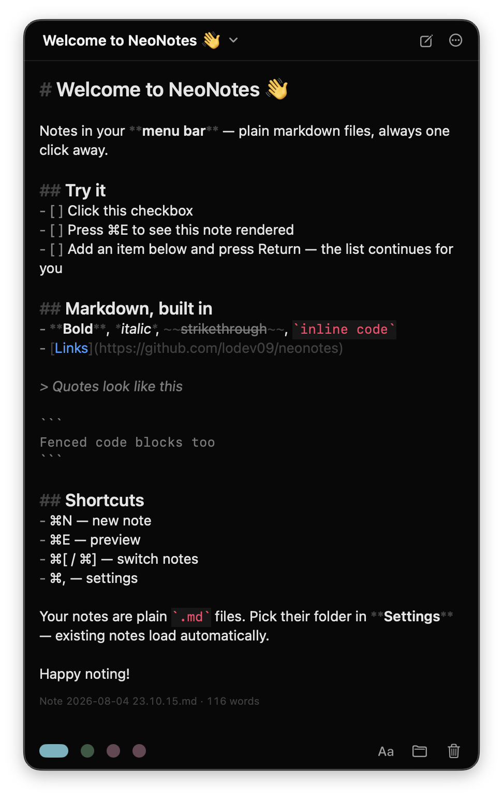

# NeoNotes

Markdown notes in your macOS menu bar — always one click away.



## Features

- **Menu bar native** — no dock icon
- **Plain markdown files** — notes are `.md` files in a folder you choose
- **Live syntax highlighting** while you type
- **Preview mode** — rendered markdown with tables and clickable checkboxes
- **Tasks** — `- [ ]` checkboxes, toggle in editor or preview
- **List autocomplete** — Return continues bullets, numbers, and tasks
- **Auto-sync** — external file changes are picked up automatically
- **Note colors, resizable panel, launch at login**

## Install

Build from source (requires Xcode 15+ / macOS 14+):

```sh
git clone https://github.com/lodev09/neonotes.git
cd neonotes
open NeoNotes.xcodeproj
```

Then build and run the `NeoNotes` scheme.

The project is generated with [XcodeGen](https://github.com/yonaskolb/XcodeGen) — after changing `project.yml`, run `xcodegen`.

## Shortcuts

| Shortcut | Action |
| --- | --- |
| ⌘N | New note |
| ⌘E | Toggle preview |
| ⌘[ / ⌘] | Previous / next note |
| ⌘, | Settings |

## Notes Storage

Notes live in the app's sandbox container by default, or any folder you pick in Settings (e.g. `~/Documents/Notes`). Existing `.md` files there are loaded automatically.

## Contributing

See [CONTRIBUTING.md](CONTRIBUTING.md).

## License

[MIT](LICENSE)

---

Made with ❤️ by [@lodev09](http://linkedin.com/in/lodev09/)
